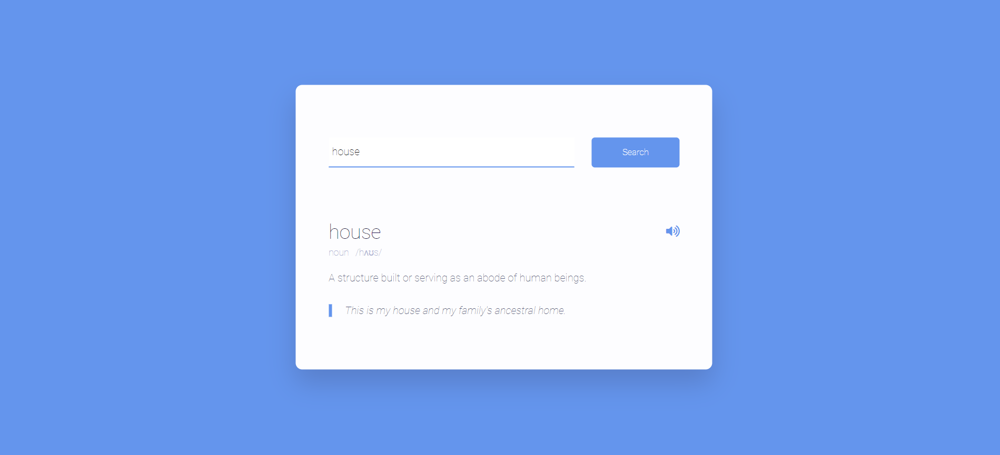

# Dictionary Search App

## Description

This project is a simple dictionary search application that demonstrates the use of the DOM and APIs in JavaScript. It allows users to search for the meaning, phonetic transcription, and example sentences of English words. When a user enters a word and clicks the "Search" button (or presses the Enter key), the app fetches the word's details from a dictionary API and displays them on the page. Additionally, users can listen to the pronunciation of the word by clicking the sound button.

## Features

- Search for the meaning, phonetic transcription, and examples of English words.
- Display the part of speech and phonetic transcription.
- Play the pronunciation of the word.
- Trigger search using the Enter key when the input is focused.

## Technologies Used

- HTML
- CSS
- JavaScript
- [Dictionary API](https://dictionaryapi.dev/)

## Notes

- Ensure you have an active internet connection to fetch data from the API.
- The project demonstrates basic DOM manipulation and API interaction. Further enhancements and error handling can be added as needed.

